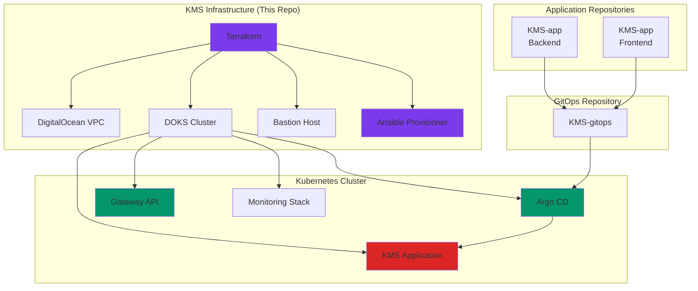
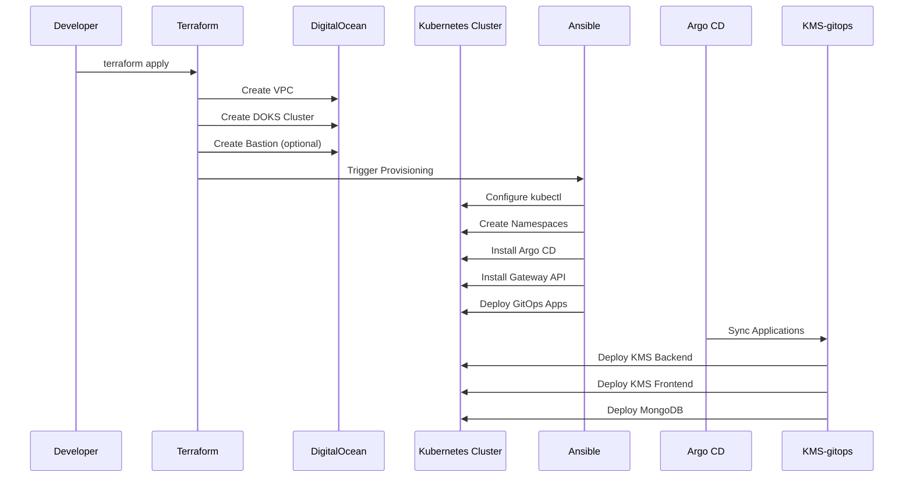
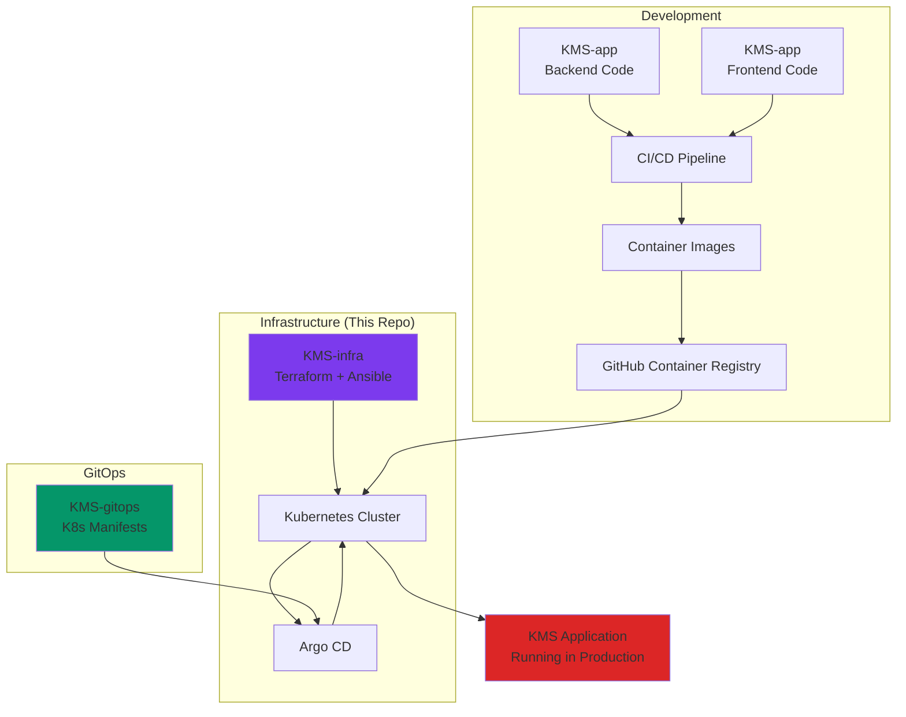

# 🏗️ KMS Infrastructure as Code (IaC)

> **Infrastructure automation for the Kitchen Management System (KMS) on DigitalOcean Kubernetes**

This repository contains Terraform and Ansible automation to provision and configure the complete cloud infrastructure for the KMS application. It automates the creation of a production-ready Kubernetes cluster with GitOps, monitoring, and networking components.

---

## 📋 Table of Contents

- [Overview](#-overview)
- [What is KMS?](#-what-is-kms)
- [Architecture](#-architecture)
- [Components](#-components)
- [Repository Structure](#-repository-structure)
- [Prerequisites](#-prerequisites)
- [Quick Start](#-quick-start)
- [Configuration](#-configuration)
- [How It Works](#-how-it-works)
- [Integration with KMS Ecosystem](#-integration-with-kms-ecosystem)
- [Cost Estimation](#-cost-estimation)
- [Troubleshooting](#-troubleshooting)

---

## 🎯 Overview

**KMS-infra** is the infrastructure foundation for the Kitchen Management System. It provides:

- ✅ **Infrastructure as Code (IaC)** - Version-controlled, repeatable infrastructure
- ✅ **Automated Provisioning** - One command to deploy entire infrastructure
- ✅ **Production-Ready Setup** - Kubernetes cluster with GitOps, monitoring, and networking
- ✅ **Scalable Architecture** - Built on DigitalOcean Kubernetes (DOKS)
- ✅ **GitOps Integration** - Automatic deployment via Argo CD

### Why This Repository?

Instead of manually clicking through cloud provider dashboards, this repository allows you to:

1. **Define infrastructure in code** - Track changes, review, and collaborate
2. **Deploy consistently** - Same infrastructure every time, across environments
3. **Automate post-deployment** - Ansible configures Kubernetes after cluster creation
4. **Reduce human error** - Automated processes eliminate manual mistakes
5. **Enable GitOps** - Infrastructure changes trigger application deployments

---

## 🍽️ What is KMS?

The **Kitchen Management System (KMS)** is a comprehensive platform for managing:

- 👥 **Staff Management** - User roles, attendance tracking, permissions
- 🍲 **Meal Planning** - Menu creation, meal scheduling, dietary preferences
- 📦 **Inventory Management** - Ingredient tracking, batch management, stock levels
- 💰 **Financial Operations** - Pricing, payments, cost tracking
- 📊 **Analytics & Reporting** - Meal consumption, inventory usage, staff metrics

**KMS-infra** provides the cloud infrastructure to run this application at scale.

---

## 🏛️ Architecture

### High-Level Architecture



### Infrastructure Components Flow



---

## 🧩 Components

### 1. **Terraform Modules**

#### VPC Module (`modules/vpc/`)
- Creates a private Virtual Private Cloud (VPC)
- Provides network isolation and security
- IP range: `10.0.0.0/16`

#### DOKS Module (`modules/doks/`)
- Provisions DigitalOcean Kubernetes Service (DOKS) cluster
- Configurable node pools (size, count)
- Automatic Kubernetes version management

#### Bastion Module (`modules/droplet/`)
- Optional jump host for secure cluster access
- Provides SSH access to private cluster resources
- Can be disabled for cost savings

### 2. **Ansible Automation (`ansible/`)**

Post-deployment configuration that:

1. **Configures kubectl** - Sets up cluster access
2. **Creates Namespaces** - `kms`, `monitoring`, `argocd`
3. **Sets up GHCR Secrets** - For pulling private container images
4. **Installs Argo CD** - GitOps continuous deployment tool
5. **Installs Gateway API** - Modern Kubernetes ingress/routing
6. **Deploys GitOps Applications** - Connects to KMS-gitops repository

### 3. **Integration Points**

- **KMS-gitops** - Kubernetes manifests repository (deployed via Argo CD)
- **KMS-app** - Application code repositories (built into containers)
- **GitHub Container Registry (GHCR)** - Container image storage

---

## 📁 Repository Structure

```
KMS-infra/
├── terraform/
│   ├── main.tf                 # Main Terraform configuration
│   ├── variables.tf            # Input variables
│   ├── outputs.tf              # Output values
│   ├── versions.tf             # Provider versions
│   ├── terraform.tfvars.example # Configuration template
│   └── modules/
│       ├── vpc/                # VPC module
│       ├── doks/               # Kubernetes cluster module
│       └── droplet/            # Bastion host module
│
├── ansible/
│   ├── configure-doks.yml      # Main Ansible playbook
│   ├── inventory.yml           # Ansible inventory
│   ├── group_vars/
│   │   └── all.yml            # Ansible variables
│   └── README.md               # Ansible documentation
│
└── README.md                   # This file
```

---

## 🔧 Prerequisites

Before using this repository, ensure you have:

### Required Tools

| Tool | Purpose | Installation |
|------|---------|--------------|
| **Terraform** (≥1.5.0) | Infrastructure provisioning | [Install Guide](https://developer.hashicorp.com/terraform/downloads) |
| **Ansible** | Post-deployment configuration | `pip install ansible` or `apt install ansible` |
| **kubectl** | Kubernetes cluster management | [Install Guide](https://kubernetes.io/docs/tasks/tools/) |
| **doctl** | DigitalOcean CLI | [Install Guide](https://docs.digitalocean.com/reference/doctl/how-to/install/) |

### Required Accounts & Tokens

1. **DigitalOcean Account**
   - API Token with write permissions
   - Get from: [DigitalOcean API Tokens](https://cloud.digitalocean.com/account/api/tokens)

2. **GitHub Account** (Optional, for private images)
   - Personal Access Token (PAT) with `read:packages` scope
   - Get from: [GitHub Settings → Developer Settings → Tokens](https://github.com/settings/tokens)

### Verify Installation

```bash
# Check all tools are installed
terraform version
ansible --version
kubectl version --client
doctl version
```

---

## 🚀 Quick Start

### Step 1: Clone and Configure

```bash
# Clone the repository
git clone <your-repo-url> KMS-infra
cd KMS-infra/terraform

# Copy the example configuration
cp terraform.tfvars.example terraform.tfvars

# Edit terraform.tfvars with your values
nano terraform.tfvars
```

### Step 2: Configure Variables

Edit `terraform.tfvars`:

```hcl
# Required
do_token          = "dop_v1_your_token_here"
ssh_public_key    = "ssh-rsa AAAAB3NzaC1yc2E... your-email@example.com"
region            = "nyc1"  # Choose your region

# Optional - adjust based on needs
node_size         = "s-2vcpu-4gb"  # $24/month
node_count         = 1
enable_bastion     = true
github_username    = "your-github-username"
github_pat         = "ghp_your_pat_token"  # Optional
```

### Step 3: Initialize and Deploy

```bash
# Initialize Terraform
terraform init

# Review what will be created
terraform plan

# Deploy infrastructure (takes ~10-15 minutes)
terraform apply
```

### Step 4: Access Your Cluster

After deployment completes:

```bash
# Get cluster credentials
doctl kubernetes cluster kubeconfig save kms-cluster

# Verify access
kubectl get nodes

# Access Argo CD UI
kubectl port-forward svc/argocd-server -n argocd 8080:443
# Open: https://localhost:8080
# Username: admin
# Password: kubectl -n argocd get secret argocd-initial-admin-secret -o jsonpath="{.data.password}" | base64 -d
```

---

## ⚙️ Configuration

### Terraform Variables

| Variable | Description | Default | Required |
|----------|-------------|---------|----------|
| `do_token` | DigitalOcean API token | - | ✅ Yes |
| `ssh_public_key` | SSH public key for Droplets | - | ✅ Yes |
| `region` | DigitalOcean region | `nyc1` | No |
| `project_name` | Project name prefix | `kms` | No |
| `kubernetes_version` | Kubernetes version | `1.31.1-do.0` | No |
| `node_size` | Droplet size for nodes | `s-2vcpu-4gb` | No |
| `node_count` | Number of nodes | `1` | No |
| `enable_bastion` | Create bastion host | `true` | No |
| `enable_ansible_provisioning` | Run Ansible after deploy | `true` | No |
| `github_username` | GitHub username for GHCR | `krishnamohankapri` | No |
| `github_pat` | GitHub PAT for GHCR | `""` | No |
| `gitops_repo_path` | GitOps repository path/URL | GitHub URL | No |

### Ansible Variables

Edit `ansible/group_vars/all.yml` to customize:

- Cluster name
- Namespaces to create
- Argo CD version
- Gateway API version
- GitOps repository path

---

## 🔄 How It Works

### Deployment Flow


### What Happens During `terraform apply`?

1. **Terraform Phase**
   - Creates VPC with private IP range
   - Provisions DOKS cluster with node pool
   - Optionally creates bastion droplet
   - Generates SSH keys

2. **Ansible Phase** (if enabled)
   - Configures `kubectl` to access cluster
   - Creates Kubernetes namespaces
   - Sets up GitHub Container Registry secrets
   - Installs Argo CD for GitOps
   - Installs Gateway API and Envoy Gateway
   - Applies Argo CD Application manifests

3. **Argo CD Phase** (automatic)
   - Argo CD connects to KMS-gitops repository
   - Syncs and deploys applications:
     - MongoDB database
     - KMS Backend API
     - KMS Frontend
     - Monitoring stack (Loki, Grafana, Prometheus, etc.)

---

## 🔗 Integration with KMS Ecosystem

### Repository Relationships



### How Repositories Work Together

1. **KMS-infra** (This repo)
   - Provisions cloud infrastructure
   - Sets up Kubernetes cluster
   - Installs GitOps tools

2. **KMS-gitops**
   - Contains Kubernetes manifests
   - Defines application deployments
   - Managed by Argo CD

3. **KMS-app**
   - Contains application source code
   - Built into container images
   - Pushed to GitHub Container Registry

**Workflow:**
```
Code Change → CI/CD Builds Image → Push to GHCR → 
Update KMS-gitops → Argo CD Detects Change → 
Deploys New Version to Cluster
```

---

## 💰 Cost Estimation

### Monthly Costs (USD)

| Component | Size | Monthly Cost |
|-----------|------|--------------|
| **DOKS Cluster** | Control plane | $12/month (free for first cluster) |
| **Kubernetes Nodes** | s-2vcpu-4gb × 1 | $24/month |
| **Bastion Droplet** | s-1vcpu-1gb (optional) | $6/month |
| **VPC** | Network | Free |
| **Load Balancer** | (via Gateway API) | $12/month |
| **Total (with bastion)** | | **~$42/month** |
| **Total (without bastion)** | | **~$36/month** |

### Cost Optimization Tips

- Start with 1 node, scale as needed
- Disable bastion if not needed (`enable_bastion = false`)
- Use smaller node sizes for development
- Enable auto-scaling for production workloads

---

## 🛠️ Troubleshooting

### Common Issues

#### 1. Terraform fails with "Invalid token"
```bash
# Verify your DigitalOcean token
doctl auth init
doctl account get
```

#### 2. Ansible fails with "kubectl not found"
```bash
# Install kubectl
curl -LO "https://dl.k8s.io/release/$(curl -L -s https://dl.k8s.io/release/stable.txt)/bin/linux/amd64/kubectl"
sudo install -o root -g root -m 0755 kubectl /usr/local/bin/kubectl
```

#### 3. Ansible fails with "doctl not found"
```bash
# Install doctl
cd ~
wget https://github.com/digitalocean/doctl/releases/download/v1.104.0/doctl-1.104.0-linux-amd64.tar.gz
tar xf doctl-1.104.0-linux-amd64.tar.gz
sudo mv doctl /usr/local/bin
```

#### 4. Argo CD not accessible
```bash
# Check Argo CD pods
kubectl get pods -n argocd

# Get admin password
kubectl -n argocd get secret argocd-initial-admin-secret -o jsonpath="{.data.password}" | base64 -d

# Port forward
kubectl port-forward svc/argocd-server -n argocd 8080:443
```

#### 5. Cluster nodes not ready
```bash
# Check node status
kubectl get nodes

# Describe node for details
kubectl describe node <node-name>
```

### Getting Help

- Check [Ansible README](./ansible/README.md) for Ansible-specific issues
- Review Terraform outputs: `terraform output`
- Check DigitalOcean status: [status.digitalocean.com](https://status.digitalocean.com)

---

## 📚 Additional Resources

- [DigitalOcean Kubernetes Documentation](https://docs.digitalocean.com/products/kubernetes/)
- [Terraform DigitalOcean Provider](https://registry.terraform.io/providers/digitalocean/digitalocean/latest/docs)
- [Argo CD Documentation](https://argo-cd.readthedocs.io/)
- [Gateway API Documentation](https://gateway-api.sigs.k8s.io/)

---

## 📝 License

[Add your license here]

---

## 👥 Contributing

[Add contribution guidelines if applicable]

---

**Built with ❤️ for the Kitchen Management System**
