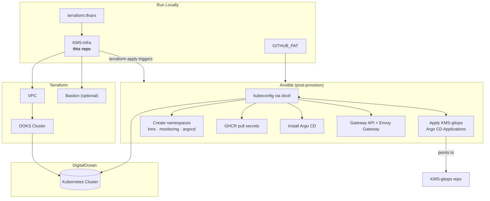

# KMS Infrastructure

Terraform and Ansible automation that provisions and bootstraps the DigitalOcean Kubernetes cluster.

## Architecture

```mermaid
flowchart TB
    subgraph local["Run Locally"]
        TF["KMS-infra<br/><b>this repo</b>"]
        TFVARS["terraform.tfvars"]
        PAT["GITHUB_PAT"]
    end

    subgraph terraform["Terraform"]
        VPC["VPC"]
        DOKS["DOKS Cluster"]
        BASTION["Bastion (optional)"]
    end

    subgraph ansible["Ansible (post-provision)"]
        KCFG["kubeconfig via doctl"]
        NS["Create namespaces<br/>kms · monitoring · argocd"]
        SEC["GHCR pull secrets"]
        ARGO["Install Argo CD"]
        GW["Gateway API + Envoy Gateway"]
        APPS["Apply KMS-gitops<br/>Argo CD Applications"]
    end

    subgraph cloud["DigitalOcean"]
        CLUSTER[("Kubernetes Cluster")]
    end

    TFVARS --> TF
    PAT --> ansible
    TF --> VPC --> DOKS
    TF --> BASTION
    DOKS --> CLUSTER
    TF -->|terraform apply triggers| ansible
    ansible --> KCFG --> CLUSTER
    KCFG --> NS & SEC & ARGO & GW & APPS
    APPS -->|points to| GITOPS["KMS-gitops repo"]
```

## Three Repositories

| Repository | Role |
|------------|------|
| **KMS-app** | Application source code, Dockerfiles, GitHub Actions CI |
| **KMS-gitops** | Kubernetes manifests, Kustomize, Argo CD applications |
| **KMS-infra** (here) | Terraform (VPC, DOKS) + Ansible (cluster bootstrap) |

## Bootstrap Steps

1. **Terraform** — creates VPC, DOKS cluster, SSH key, optional bastion  
2. **Ansible** — saves kubeconfig, creates namespaces, GHCR secrets, installs Argo CD + Envoy Gateway  
3. **Argo CD** — registers applications from **KMS-gitops**; ongoing app deploys are handled by GitOps, not this repo  
